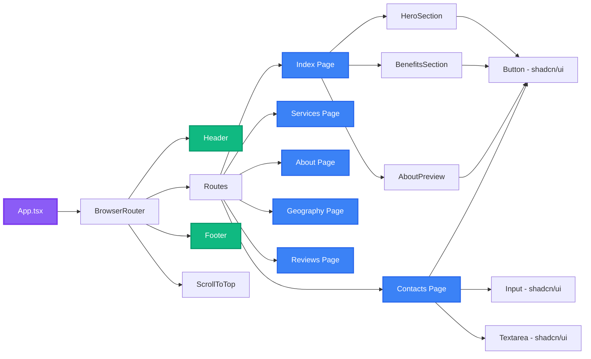
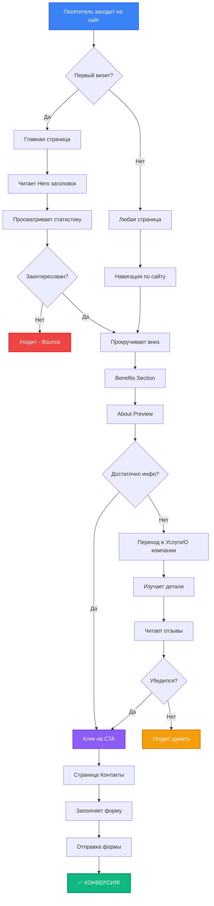
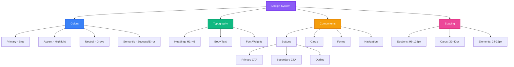
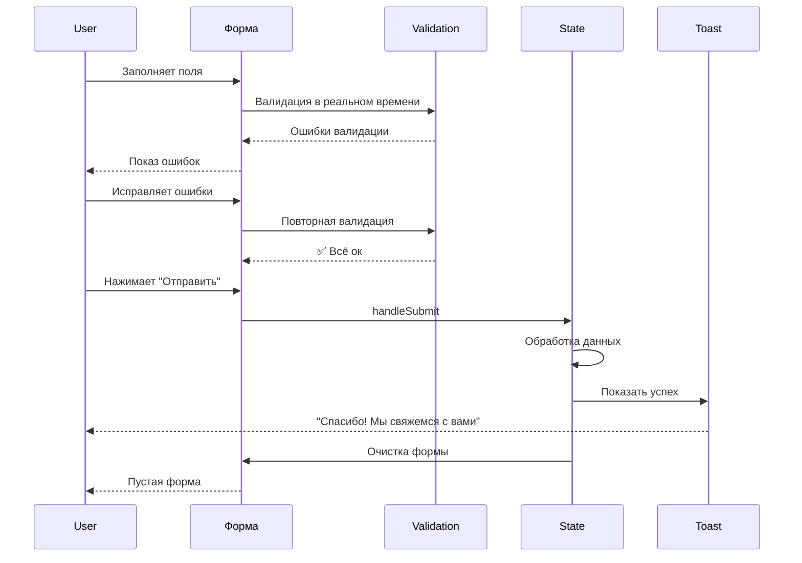
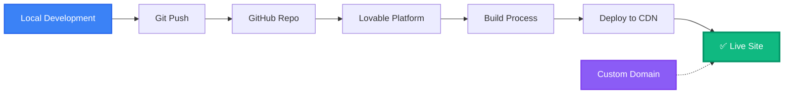
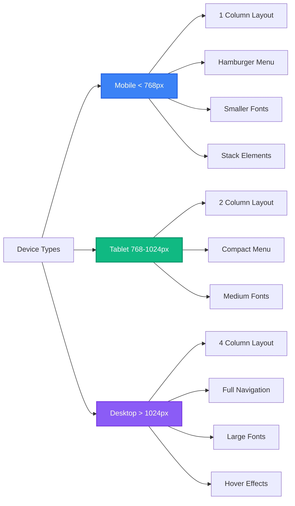
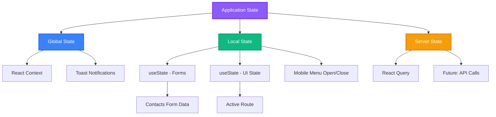
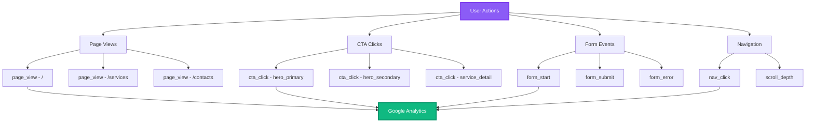
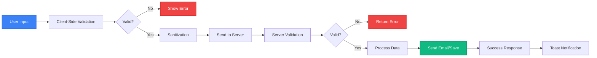

# Архитектурные диаграммы Armax Logistics

## 🗺️ Карта сайта (Site Map)

```mermaid
graph TD
    A[armax-logistics-showcase] --> B[Header - Global]
    A --> C[Routes]
    A --> D[Footer - Global]
    
    C --> E[/ - Главная]
    C --> F[/services - Услуги]
    C --> G[/about - О компании]
    C --> H[/geography - География]
    C --> I[/reviews - Отзывы]
    C --> J[/contacts - Контакты]
    C --> K[/404 - Not Found]
    
    E --> E1[HeroSection]
    E --> E2[BenefitsSection]
    E --> E3[AboutPreview]
    
    F --> F1[Hero + 4 Services]
    F --> F2[Why Choose Us]
    
    G --> G1[Hero + История]
    G --> G2[Статистика]
    G --> G3[Миссия + Ценности]
    
    H --> H1[Hero + Map]
    H --> H2[3 Региона]
    H --> H3[Маршруты]
    
    I --> I1[Hero + Отзывы]
    I --> I2[Кейсы]
    
    J --> J1[Hero + Контакты]
    J --> J2[Форма + Карта]
    
    style A fill:#3b82f6,stroke:#1e40af,stroke-width:3px,color:#fff
    style B fill:#10b981,stroke:#059669,stroke-width:2px,color:#fff
    style D fill:#10b981,stroke:#059669,stroke-width:2px,color:#fff
    style E fill:#f59e0b,stroke:#d97706,stroke-width:2px,color:#fff
    style F fill:#f59e0b,stroke:#d97706,stroke-width:2px,color:#fff
    style G fill:#f59e0b,stroke:#d97706,stroke-width:2px,color:#fff
    style H fill:#f59e0b,stroke:#d97706,stroke-width:2px,color:#fff
    style I fill:#f59e0b,stroke:#d97706,stroke-width:2px,color:#fff
    style J fill:#f59e0b,stroke:#d97706,stroke-width:2px,color:#fff
```

## 🧩 Компонентная архитектура



## 🔄 User Flow: Конверсия в лид



## 📊 Конверсионная воронка

```mermaid
funnel
    title Конверсионная воронка Armax Logistics
    section Визиты
        "Посетители сайта": 100
    section Вовлечённость
        "Остаются на сайте (не bounce)": 70
        "Прокручивают страницу": 50
    section Интерес
        "Кликают на CTA": 20
        "Переходят на Контакты": 15
    section Конверсия
        "Начинают заполнять форму": 10
        "Отправляют заявку": 5
```

## 🎨 Дизайн-система: Иерархия



## 🔗 Data Flow: Форма контактов



## 🚀 Deployment Flow



## 📱 Responsive Breakpoints



## 🎯 CTA Strategy Map

```mermaid
graph TD
    A[CTA Strategy] --> B[Header - Global]
    A --> C[Page-Specific]
    A --> D[Footer Links]
    
    B --> B1["Отправить заявку" - All Pages]
    
    C --> C1[Главная]
    C --> C2[Услуги]
    C --> C3[About Preview]
    
    C1 --> C1A["Получить предложение"]
    C1 --> C1B["Наши услуги"]
    C1A --> E[/contacts]
    C1B --> F[/services]
    
    C2 --> C2A["Узнать подробнее" x4]
    C2A --> E
    
    C3 --> C3A["Подробнее о компании"]
    C3A --> G[/about]
    
    B1 --> E
    
    style A fill:#8b5cf6,stroke:#7c3aed,stroke-width:3px,color:#fff
    style E fill:#10b981,stroke:#059669,stroke-width:3px,color:#fff
    style B1 fill:#f59e0b,stroke:#d97706,stroke-width:2px,color:#fff
```

## 🔄 State Management



## 📈 Analytics Events (Planned)



## 🔐 Security Flow



---

## 📊 Легенда цветов

- 🔵 **Синий** - Основные элементы (страницы, компоненты)
- 🟢 **Зелёный** - Глобальные/успешные элементы (Header, Footer, Success)
- 🟣 **Фиолетовый** - Корневые элементы (App, Design System)
- 🟠 **Оранжевый** - Важные точки (CTA, Pages)
- 🔴 **Красный** - Ошибки, выходы (Bounce, Errors)
- 🟡 **Жёлтый** - Промежуточные состояния

---

**Создано**: 2025-11-07  
**Инструмент**: Mermaid.js  
**Для проекта**: Armax Logistics Showcase

> **Примечание**: Диаграммы автоматически отображаются на GitHub в README файлах

